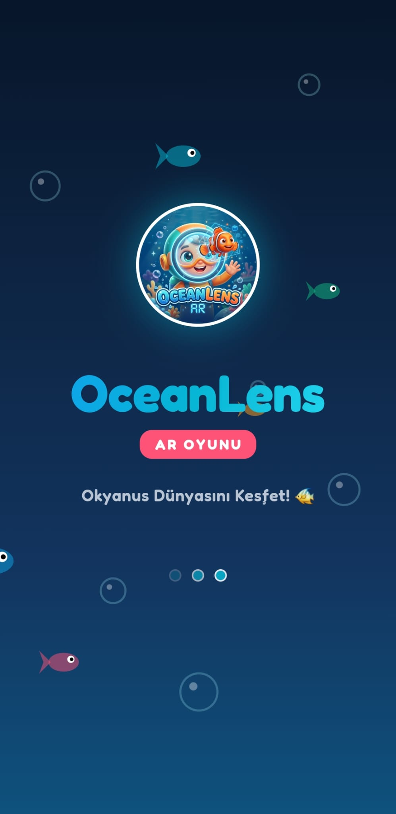
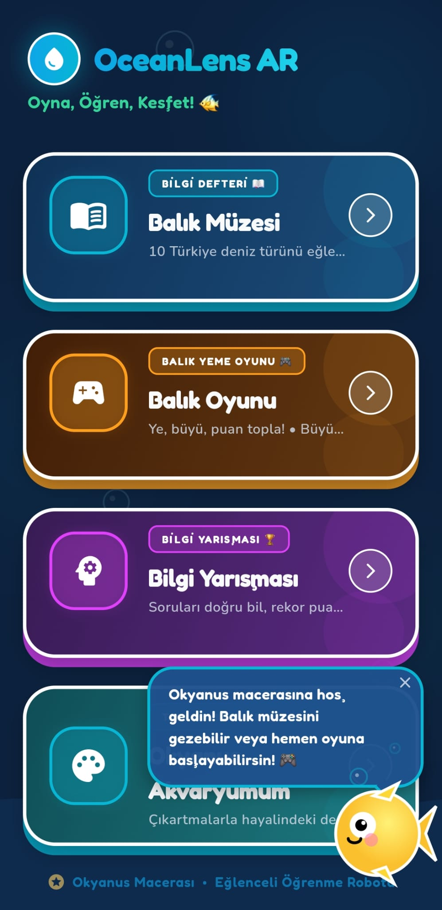
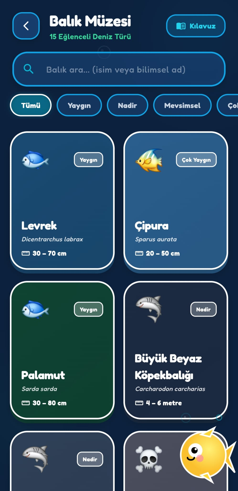
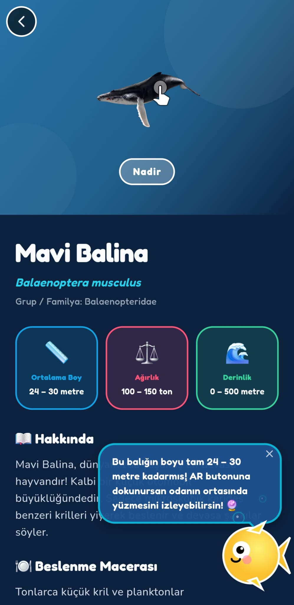
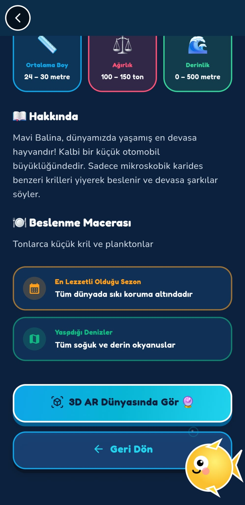
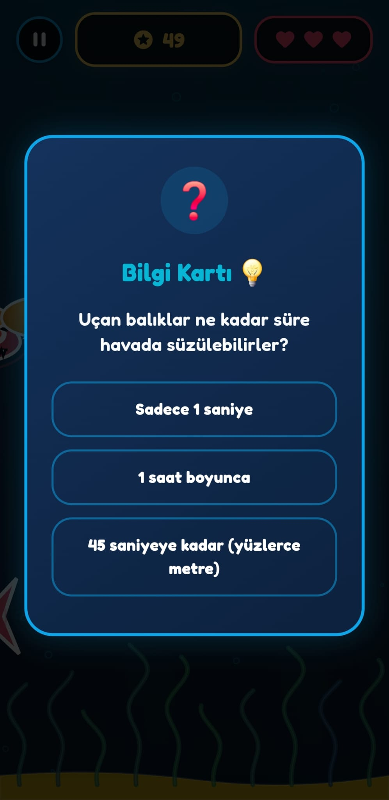
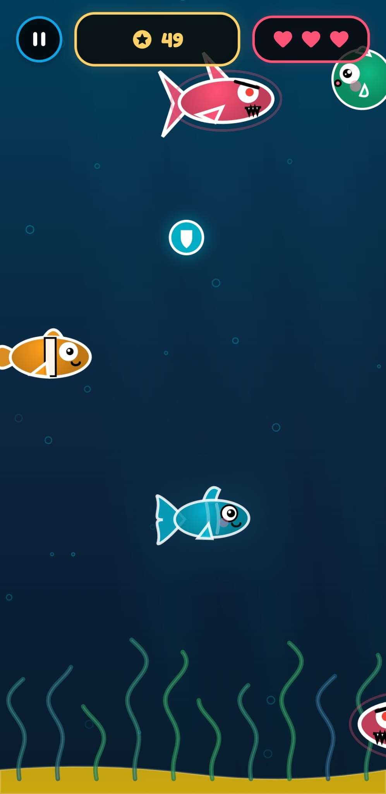
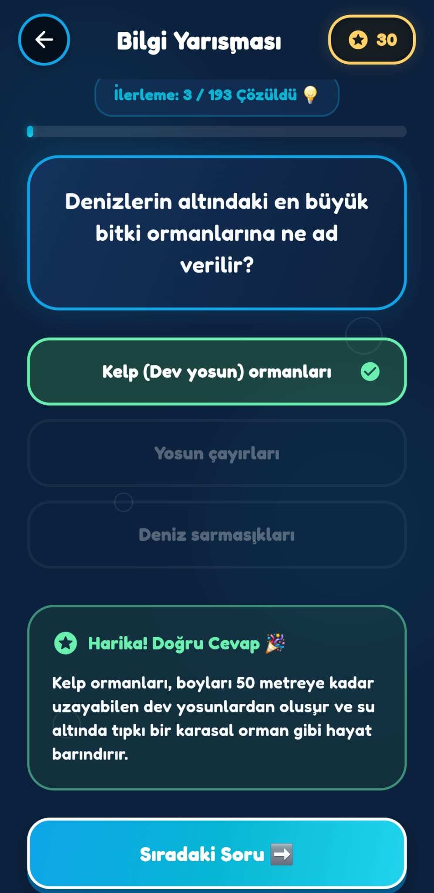
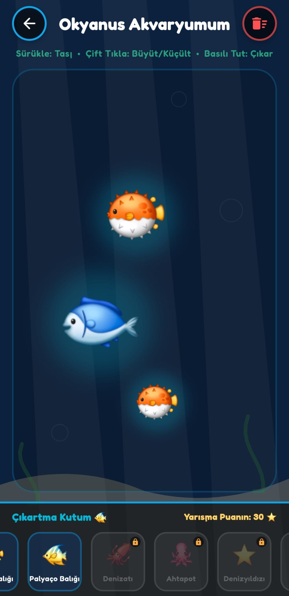
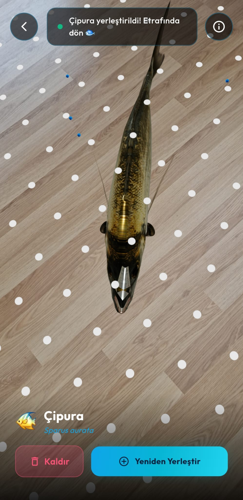

# 🌊 OceanLens AR: Mobil Artırılmış Gerçeklik Okyanus Keşfi ve Eğitim Oyunu

[](https://flutter.dev)
[](https://dart.dev)
[](#)
[](#)

**OceanLens AR**, çocuklar için tasarlanmış, okyanus yaşamını eğlenceli ve etkileşimli bir şekilde öğreten, artırılmış gerçeklik (AR) destekli, oyunlaştırılmış bir mobil eğitim uygulamasıdır. Çocuklar balıkları 3D AR dünyasında inceleyebilir, okyanusta hayatta kalma oyunu oynayabilir, bilgi yarışması çözerek puan kazanabilir ve kazandıkları puanlarla kendi dijital çıkartma akvaryumlarını tasarlayabilirler.

---

## 📸 Uygulama Görselleri

<table>
  <tr>
    <td align="center"><br/><sub>Açılış Ekranı</sub></td>
    <td align="center"><br/><sub>Ana Menü</sub></td>
    <td align="center"><br/><sub>Balık Müzesi</sub></td>
  </tr>
  <tr>
    <td align="center"><br/><sub>Balık Müzesi Bilgi Kartı</sub></td>
    <td align="center"><br/><sub>Balık Müzesi Bilgi Kartı 2</sub></td>
    <td align="center"><br/><sub>Bilgi Kartı</sub></td>
  </tr>
  <tr>
    <td align="center"><br/><sub>Balık Oyunu</sub></td>
    <td align="center"><br/><sub>Bilgi Yarışması</sub></td>
    <td align="center"><br/><sub>Çıkartma Akvaryumu</sub></td>
  </tr>
  <tr>
    <td align="center" colspan="3"><br/><sub>AR ile Balık Görüntüleme</sub></td>
  </tr>
</table>

---

## 🚀 Öne Çıkan Özellikler

### 1. 🤿 Balık Müzesi & 3D AR Görüntüleyici
*   **3D AR Deneyimi:** Google Filament ve Sceneview kütüphaneleri tabanlı native Android AR entegrasyonu ile okyanus canlılarını odanıza getirin.
*   **Ölçeklendirilmiş Canlılar:** Dev Mavi Balina'dan minik Japon Balığına kadar tüm canlılar, gerçekçi ve dengeli boyut algısı sağlayacak şekilde ölçeklendirildi.
*   **Canlı Yüzme Animasyonları:** Yerleştirilen 3D balıklar AR kamerada sabit durmaz, native seviyede tetiklenen yüzme/idle animasyonları ile odanızda hareket eder.
*   **Güvenli Altyapı:** Native Filament yükleme donmalarını engellemek amacıyla `Throwable` seviyesinde exception yakalama mekanizması uygulandı.

### 2. 🎮 Okyanus Hayatta Kalma Oyunu (Hard Seviye)
*   **Büyüme Mekaniği:** Oyuncu balığı yönlendirerek kendinden küçük yeşil (**yenilebilir**) balıkları yiyip büyür, kendinden büyük kırmızı (**tehlikeli**) balıklardan kaçar.
*   **Akıllı Boyut Dinamikleri:** AI balıklarının renkleri ve durumları, oyuncu balığının yarıçapına kıyasla gerçek zamanlı olarak değişir.
*   **15 Saniyede Bir Bilgi Kartı:** Oyun oynanırken her 15 saniyede bir okyanus hakkında eğitici bir soru kartı tetiklenir. Doğru bilirseniz ekstra kalkan veya hız bonusu kazanırsınız.
*   **Gelişmiş Zorluk Dengesi:**
    *   Yapay zeka balıklarının yüzme hızları artırıldı.
    *   Spawn olasılıkları zorlaştırıldı (%40 yenilebilir yeşil, %35 nötr sarı, %25 tehlikeli kırmızı).
    *   Skor arttıkça yeni düşman spawn olma sıklığı dinamik olarak artar (minimum spawn aralığı 1.2 saniyeye kadar düşer).

### 3. 🧠 Kalıcı İlerlemeli Bilgi Yarışması (Quiz)
*   **200 Benzersiz Soru:** Çocukların okyanusları tanıması için hazırlanmış, açıklamalı ve eğitici 200 adet Türkçe soru.
*   **Soru Tekrarını Önleme:** Çözülen sorular yerel hafızaya (`ocean_quiz_answered.txt`) kaydedilir ve uygulama kapatılıp açılsa dahi tüm sorular bitene kadar aynı soru tekrar sorulmaz.
*   **İlerleme Takip Arayüzü:** Üst barda yer alan `X / 200 Çözüldü` sayacı ve okyanus temalı gradient dolgulu ilerleme çubuğu (Progress Bar).
*   **Tebrikler / Zafer Ekranı:** Tüm soruları tamamlayan çocuklara "Denizlerin Bilgesi" unvanını veren, kupa animasyonlu şık bir zafer ekranı sunulur. Onay pencereli "Yarışmayı Sıfırla" butonuyla baştan başlanabilir.

### 4. 🎨 Okyanus Akvaryumum (Çıkartma Panosu)
*   **Sürükle-Bırak Kanvası:** Bilgi yarışmasından kazanılan puanlarla açılan çıkartmaları (Mavi Balina, Balon Balığı, Denizyıldızı vb.) akvaryum panosuna sürükleyip yerleştirin.
*   **Boyutlandırma ve Kaldırma:** Çıkartmalara çift tıklayarak boyutları (0.7x ile 2.2x arası) döngüsel olarak ayarlanabilir, uzun basılarak akvaryumdan kaldırılabilir.
*   **Otomatik Kaydetme (Auto-Save):** Akvaryum tasarımı otomatik olarak yerel hafızaya (`ocean_aquarium.json`) kaydedilir, uygulama açıldığında kaldığı gibi yüklenir.

### 5. 🔊 Oyunlaştırılmış Ses Efektleri & Su Ambiyansı
*   **Kanal Tabanlı Audio Servis (`audio_service.dart`):** Aynı anda birden fazla ses efektini (tıklama, balık yeme, quiz doğru/yanlış, oyun bitişi) birbirini kesmeden çalabilen özelleştirilmiş altyapı.
*   **Derin Su Ambiyansı (`ambient_water.wav`):** Okyanus oyununda çalan, kesintisiz döngüye (loop) giren rahatlatıcı derin deniz su ve baloncuk sesi.

### 6. 📱 Çocuk Dostu Arayüz & Görsel Kimlik
*   **Çarpıcı Tasarım:** Canlı okyanus renk tonları (turkuaz, lacivert, altın sarısı), cam benzeri glassmorphism kart tasarımları ve mikro etkileşim animasyonları.
*   **Özel Logo ve Launcher İkonları:** Daire şeklinde kesilmiş, 3D sevimli balon balığı ve mercan tasarımlı yeni Android dairesel launcher ikonları (`ic_launcher_round.png`) ve açılış (splash) logosu.

---

## 🛠️ Kullanılan Teknolojiler

*   **Çekirdek:** Flutter (Dart)
*   **Oyun Motoru:** Flame Engine (2D Fizik ve Çarpışma Yönetimi)
*   **AR Görüntüleyici:** Native Kotlin + Google Filament / Sceneview SDK
*   **Durum Yönetimi:** Flutter Riverpod
*   **Veri Depolama:** `path_provider` (Cihaz yerel dosya okuma/yazma sistemleri)
*   **Ses Oynatıcı:** `audioplayers`
*   **Yazı Tipleri:** Google Fonts (Fredoka)

---

## 📁 Proje Yapısı

```text
lib/
├── core/
│   ├── constants/       # Uygulama içi renk paletleri (AppColors)
│   ├── services/        # Kanal tabanlı AudioService
│   └── theme/           # Çocuk dostu genel yazı tipi ve tema ayarları
├── features/
│   ├── ar_viewer/       # 3D AR balık görüntüleme arayüzü ve entegrasyonu
│   ├── aquarium/        # Okyanus Akvaryumum çıkartma panosu ve depolama servisi
│   ├── game/            # Flame okyanus oyunu, oyuncu ve yapay zeka balık sınıfları
│   │   └── data/        # Genişletilmiş 200 soruluk okyanus soruları veritabanı
│   ├── home/            # Navigasyon kartları ve ana menü arayüzü
│   └── quiz/            # Bilgi Yarışması ekranı ve ilerleme depolama servisi
```

---

## 📥 Kurulum ve Çalıştırma

Projeyi yerel makinenizde çalıştırmak için aşağıdaki adımları izleyin.

### Gereksinimler
*   Flutter SDK (v3.22.0 veya üzeri önerilir)
*   Android SDK / Xcode (iOS için)
*   Cihazınızın AR kütüphanesini (ARCore) desteklemesi gerekir.

### Kurulum Adımları
1.  Depoyu bilgisayarınıza klonlayın:
    ```bash
    git clone https://github.com/kullaniciadi/ocean_lens_ar.git
    cd ocean_lens_ar
    ```
2.  Gerekli bağımlılıkları indirin:
    ```bash
    flutter pub get
    ```
3.  Projeyi analiz edin (Hata/Uyarı denetimi):
    ```bash
    flutter analyze
    ```

### Cihazda Çalıştırma

#### Android
Cihazınızı bilgisayarınıza bağlayın (veya Emülatör başlatın) ve çalıştırın:
```bash
flutter run
```
Release APK çıktısı almak için:
```bash
flutter build apk --release
```

#### iOS (Mac Gerektirir)
1.  iOS kütüphanelerini yükleyin:
    ```bash
    cd ios
    pod install
    cd ..
    ```
2.  Xcode üzerinden `ios/Runner.xcworkspace` dosyasını açın.
3.  **Signing & Capabilities** sekmesinden geliştirici hesabınızı ve Team bilginizi ekleyin.
4.  Cihazınızı bağlayıp çalıştırın:
    ```bash
    flutter run
    ```

---

## 📦 İndirme Linkleri

> Projenin **3D model dosyaları** (`.glb`) ve derlenmiş **Android APK** dosyası, dosya boyutları nedeniyle GitHub üzerinde barındırılmamaktadır.
> Aşağıdaki Google Drive bağlantısından tüm dosyalara erişebilirsiniz:
>
> 🔗 **[Google Drive — 3D Modeller & Android APK](https://drive.google.com/drive/folders/17wXgngqpeMT_WU4Mwc99joYoupIyfE6P?usp=sharing)**

---

## 🤝 Katkıda Bulunma

1.  Bu depoyu forklayın (fork).
2.  Yeni bir özellik dalı oluşturun (`git checkout -b ozellik/yeniOzellik`).
3.  Değişikliklerinizi commitleyin (`git commit -m 'Yeni özellik eklendi'`).
4.  Dalı pushlayın (`git push origin ozellik/yeniOzellik`).
5.  Bir Pull Request (Çekme İsteği) oluşturun.

## 👨‍💻 Geliştirici

<table>
  <tr>
    <td align="center" style="border: 1px solid #e1e4e8; border-radius: 10px; padding: 16px;">
      <a href="https://github.com/dev-yuci">
        
        <br/><br/>
        <b>Yusuf AYTAŞ</b>
        <br/>
        <sub>@dev-yuci</sub>
      </a>
    </td>
  </tr>
</table>

---

## 📄 Lisans

Bu proje **MIT Lisansı** altında lisanslanmıştır. Detaylar için `LICENSE` dosyasına göz atabilirsiniz.
